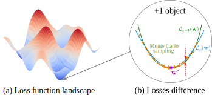

# Robust Convergence of Loss Landscapes through Distributional Averaging

[](paper/main.pdf)
[](paper/main.pdf)
[](slides/main.pdf)

This is the official implementation of the paper **Robust Convergence of Loss Landscapes through Distributional Averaging** by [Nikita Kiselev](https://kisnikser.github.io/), [Vladislav Meshkov](https://github.com/VseMeshkov) and [Andrey Grabovoy](https://scholar.google.com/citations?user=ZtI9pgsAAAAJ&hl=ru&oi=sra).

<div align="center">
    
</div>

> **Abstract:** _Understanding how a neural network’s loss landscape evolves with dataset size is essential for identifying sufficient training data. Prior analyses of this problem have typically been local, focusing on second-order expansions around a single optimum and bounding convergence through Hessian properties. While such studies clarify convergence rates, they provide only a pointwise view of stability. In this paper, we extend the framework to a distributional paradigm. Instead of analyzing convergence at one optimum, we evaluate it in expectation over a parameter distribution. This approach captures how entire neighborhoods of the loss landscape stabilize as additional samples are added. We focus on Gaussian distributions centered at local minima and employ Monte Carlo sampling to estimate convergence in practice. Theoretically, we show that distributional convergence exhibits the same asymptotic rate as the local case, while offering a more robust picture of stability. Empirical studies on image classification tasks confirm these predictions and highlight how architectural choices such as normalization, dropout, and network depth influence convergence. Our results broaden local convergence analyses into a distributional setting, providing stronger guarantees and practical tools for characterizing dataset sufficiency._

## Repository Structure

This repository is structured as follows:

- `code`: Experiments code with its own `README.md`
- `paper`: Preprint `main.pdf` with source LaTeX file `main.tex`.
- `slides`: Presentation slides `main.pdf` with source LaTeX file `main.tex`.

## Citation

If you find our work helpful, please cite us.

```BibTeX
@misc{kiselev2025robustlosslandscapeconvergence,
    title={Robust Convergence of Loss Landscapes through Distributional Averaging},
    author={Nikita Kiselev, Vladislav Meshkov, Andrey Grabovoy},
    year={2025}
}
```

## Licence

Our project is MIT licensed. See [LICENSE](LICENSE) for details.
